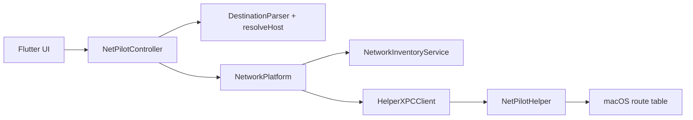

# NetPilot Desktop — Handoff

> **Keep this file current.** Any agent or developer that changes architecture, file layout, native contracts, models, or capabilities must update this document in the same change. See [`AGENTS.md`](AGENTS.md).

## Product goal

NetPilot helps developers who are connected to **Wi‑Fi (internet)** and **company LAN (intranet)** at the same time. Default macOS service order may send all traffic via Wi‑Fi, so intranet hosts become unreachable. NetPilot lets the user:

1. See currently active network interfaces.
2. Define destination rules (hostname / URL / IP / CIDR).
3. Force those destinations out the chosen LAN interface via specific routes — without flipping service order.

## Scope (MVP / v1)

| In scope | Out of scope (for now) |
|---|---|
| macOS 14+ | Windows |
| IPv4 | IPv6 |
| Hostname, URL (hostname only), IPv4, CIDR | URL path-based routing |
| Route reconcile via privileged helper | TLS MITM / HTTPS path inspection |
| Local rule persistence | Cloud sync / accounts |
| Simple desktop UI | Tray-only / menubar-only app |

## Architecture overview

```text
Flutter UI
  → NetPilotController / DestinationParser / RouteReconciler
  → MethodChannel + EventChannel
       → NetworkInventoryService (SystemConfiguration)
       → HelperXPCClient → NetPilotHelper (SMAppService / NSXPC)
            → /sbin/route (fixed argv only)
```



## Repository map

```text
netpilot_desktop/
├── AGENTS.md
├── HANDOFF.md
├── README.md
├── pubspec.yaml
├── lib/
│   ├── main.dart
│   ├── app/
│   │   ├── netpilot_app.dart
│   │   └── theme.dart
│   ├── core/
│   │   ├── models/
│   │   │   ├── network_interface_info.dart
│   │   │   └── routing_rule.dart
│   │   ├── platform/
│   │   │   └── network_platform.dart
│   │   └── utils/
│   │       ├── destination_parser.dart
│   │       └── route_reconciler.dart
│   └── features/
│       ├── home/
│       │   └── home_page.dart
│       ├── network_interfaces/
│       │   └── presentation/interface_card.dart
│       └── routing_rules/
│           ├── data/rules_repository.dart
│           ├── domain/netpilot_controller.dart
│           └── presentation/
│               ├── rule_editor_sheet.dart
│               └── rule_tile.dart
├── test/
│   ├── destination_parser_test.dart
│   ├── route_reconciler_test.dart
│   ├── netpilot_controller_test.dart
│   └── widget_test.dart
└── macos/
    ├── Runner/Assets.xcassets/AppIcon.appiconset/  # NetPilot routing icon
    ├── scripts/
    │   ├── embed_helper.sh          # Build-phase: compile + embed helper
    │   └── patch_pbxproj.py         # Sanity check for native file refs
    ├── NetPilotHelper/
    │   ├── main.swift
    │   ├── HelperDelegate.swift
    │   ├── Info.plist
    │   ├── NetPilotHelper.entitlements
    │   └── com.netpilot.netpilotDesktop.helper.plist
    ├── Runner/
    │   ├── MainFlutterWindow.swift  # Registers NetPilotPlugin
    │   ├── NetPilotPlugin.swift
    │   ├── NetworkInventoryService.swift
    │   ├── HelperXPCClient.swift
    │   ├── NetPilotShared/
    │   │   ├── NetPilotXPCProtocol.swift
    │   │   ├── RouteSpec.swift
    │   │   └── RouteManager.swift
    │   └── *entitlements            # App Sandbox OFF for MVP networking/helper
    └── RunnerTests/
        ├── RunnerTests.swift
        └── RouteManagerTests.swift
```

## Data models

### NetworkInterfaceInfo

| Field | Type | Notes |
|---|---|---|
| id | String | BSD name |
| name | String | SC user-defined name |
| interfaceName | String | BSD name |
| kind | `wifi` \| `ethernet` \| `other` | Heuristic |
| ipv4Addresses | `List<String>` | |
| gateway | `String?` | |
| dnsServers | `List<String>` | |
| isDefaultRoute | bool | Primary IPv4 default |
| isActive | bool | Has IPv4 |

### DestinationKind

`hostname` | `url` | `ipv4` | `cidr`

URL → hostname only (path/query discarded). Parser checks URL scheme **before** CIDR slash.

### RoutingRule / DesiredRoute

See `lib/core/models/routing_rule.dart`. Desired routes carry `tag = netpilot:<ruleId>`.

## Persistence

- App support dir / `netpilot_rules.json` via `path_provider`
- `FileRulesRepository` / `MemoryRulesRepository` (tests)
- `path_provider_foundation` 2.6.0 uses Dart native assets/FFI on macOS;
  it no longer registers a Flutter plugin or installs a CocoaPod. Flutter
  generates the native asset build integration; the JSON persistence format
  and NetPilot's MethodChannel/XPC contracts are unchanged.

## Platform contracts

### MethodChannel: `com.netpilot.netpilotDesktop/network`

| Method | Args | Result |
|---|---|---|
| `listInterfaces` | — | `List<Map>` |
| `resolveHost` | `{ host, interfaceId? }` | `{ ips: List<String> }` |
| `getHelperStatus` | — | `{ installed, enabled, status, message? }` |
| `installHelper` | — | status map (+ `ok` when possible) |
| `reconcileRoutes` | `{ desired: List<RouteSpec> }` | `{ ok, added, removed, errors }` |
| `windowAction` | `{ action: close, minimize, or zoom }` | — |

### EventChannel: `com.netpilot.netpilotDesktop/networkEvents`

Emits `{ type: 'interfacesChanged' }` on SCDynamicStore changes.

### XPC (app ↔ helper)

- Mach service: `com.netpilot.netpilotDesktop.helper`
- Protocol methods: `ping`, `listManagedRoutes`, `reconcileDesired`
- Launchd plist name: `com.netpilot.netpilotDesktop.helper.plist`
- Helper binary path in app: `Contents/MacOS/NetPilotHelper`
- Plist embedded at: `Contents/Library/LaunchDaemons/`

**Security:** Destination must be IPv4 CIDR; gateway optional IPv4; interface BSD-like name; tag must start with `netpilot:`. Fixed `/sbin/route` argv only. Managed inventory persisted under `/Library/Application Support/NetPilot/managed_routes.json`.

Route argv: gateway routes use `-net <CIDR> <gateway> -ifp <BSD-name>:`;
the trailing colon encodes the interface name for macOS `link_addr`. Direct
routes without a gateway use `-net <CIDR> -interface <BSD-name>`. Add and delete
use the same selectors. Routes remain unscoped so ordinary app traffic can
match them regardless of the default interface. Do not combine a gateway with
`-iface`: macOS parses the following interface name as another IP address.

## Privileged helper build

Runner build phase **Embed NetPilot Helper** runs `macos/scripts/embed_helper.sh`, which `swiftc`-compiles helper sources into the app bundle and copies the launchd plist. Install at runtime via `SMAppService.daemon(plistName:)`.

Requires matching Team ID signatures on app + helper for real privileged install.
The build script embeds the helper Info.plist and signs the binary with its
entitlements whenever Xcode provides a signing identity; signing failures stop
the build. Without an Apple Development identity, macOS rejects the daemon with
`OS_REASON_CODESIGNING`; inventory + UI still work but routes cannot be applied.

Native helper changes require a full app rebuild. Helper status includes a live
XPC ping, so a registered but unreachable daemon is reported as `unreachable`
instead of `enabled`. Settings exposes Install / Repair, which unregisters a
stale enabled service, registers the helper from the current app bundle, and
reapplies rules after a successful ping.

## Signing & entitlements

- App: `com.netpilot.netpilotDesktop`
- Helper: `com.netpilot.netpilotDesktop.helper`
- Deployment target: **macOS 14.0**
- App Sandbox disabled in Debug/Release entitlements for MVP (network inventory + helper install)
- The native title bar and traffic-light controls are hidden. Flutter renders
  working Close / Minimize / Zoom controls through `windowAction`. The controls
  use a compact Liquid Glass-inspired capsule with adaptive light/dark material,
  gloss, depth, and hover/press feedback.

## UI map

- Home: 1180×760 initial desktop window (980×640 minimum) with Rules / Networks / Settings tabs;
  each tab owns its scrollable content. Rules includes a collapsible Diagnostics
  panel; Settings contains the light/dark theme switch. Dark mode is default
  with green primary actions on neutral graphite surfaces.
- Add/Edit sheet: destination, label, interface, resolve preview, save & apply
- Helper banner with Install when not enabled
- Route reconciliation writes desired routes, result counts, errors, and thrown
  exceptions to the `flutter run` terminal with the `[NetPilot]` prefix.

## Testing

Toolchain baseline: **Flutter 3.47.4 stable / Dart 3.13.3**. Minimum SDK
constraints are declared in `pubspec.yaml`; commit `pubspec.lock` for reproducible
package resolution. CocoaPods and Runner both target macOS 14.0.

```bash
PUB_HOSTED_URL=https://pub.dev flutter pub get   # if corporate mirror fails
flutter analyze
flutter test
flutter build macos --debug
```

XCTest: `RouteSpec` validation + `RouteManager` reconcile argv (`macos/RunnerTests/RouteManagerTests.swift`).
The route parser regression uses `/sbin/route -n -d -v get` (read-only debug
mode) to check gateway flags and interface encoding without mutating routes.

## Known limitations

- Hostname → IP: CDN/shared IPs may mis-route unrelated hosts.
- `resolveHost` uses system DNS (interface-scoped DNS reserved for later).
- Helper install needs code signing + user Login Items approval.
- No path-level URL routing.

## Architecture decisions

| Decision | Choice | Why |
|---|---|---|
| Routing key | IP / CIDR after resolve | OS routes are L3 |
| Privilege | Helper + XPC + SMAppService | Persistent, least privilege |
| Service order | Unchanged | Specific routes override default |
| URL handling | Hostname only | No TLS MITM |
| Helper embed | Build-phase `swiftc` | Avoid fragile extra Xcode target with Flutter/Pods |

## Feature status

| Feature | Status |
|---|---|
| Handoff / agent docs | Done |
| Flutter feature layout | Done |
| Interface inventory (macOS) | Done |
| Rule CRUD + persistence | Done |
| Destination parser + resolve | Done |
| Privileged helper + XPC + embed | Done (signing TBD per machine) |
| Route reconcile | Done |
| Desktop UI | Done |
| Windows | Not started |
| IPv6 | Not started |

## Changelog

- **2026-09-17** — Restyled the custom Close / Minimize / Zoom controls for the current macOS design language with an adaptive blurred glass capsule, dimensional color treatment, clear symbols, and hover/press motion; native window actions are unchanged.
- **2026-09-17** — Fixed false `enabled` helper status and eight-second timeouts with a live XPC health check, immediate XPC error completion, and a working Install / Repair flow that reapplies rules. Fixed Scrollbar controller attachment, moved theme switching exclusively to Settings, and added custom Flutter Close / Minimize / Zoom controls backed by the native MethodChannel.
- **2026-09-17** — Rebuilt the desktop UI from approved design 3: fixed-size tabbed layout, independent Rules and Networks scrolling, Settings theme switch, and in-app Diagnostics panel. The dark theme primary color is now NetPilot green while surfaces remain neutral graphite.
- **2026-09-17** — Added `[NetPilot]` route reconciliation diagnostics to the Flutter terminal, hid the native macOS title bar and traffic-light controls, changed the dark palette to neutral graphite with a muted blue accent, and bumped the app build to 1.0.1+2 so macOS refreshes the Dock icon.
- **2026-09-17** — Replaced the macOS app icon with a custom NetPilot route-and-arrow mark and generated all required AppIcon sizes (16–1024 px).
- **2026-09-17** — Added Material light and dark themes; the application defaults to dark mode. Theme-aware surface colors keep cards and form fields readable in both modes.
- **2026-09-17** — Fixed `route: bad address: en8` by separating gateway routes (`-ifp <name>:`) from direct interface routes (`-interface <name>`), matching add/delete selectors, and adding native argv plus real macOS parser regression tests. All 6 targeted native tests and `flutter build macos --debug` passed; live privileged routing was not exercised. Helper/XPC payloads and persisted route format are unchanged.
- **2026-09-17** — Upgraded to Flutter 3.47.4 stable / Dart 3.13.3, refreshed package locks and flutter_lints 6, migrated deprecated dropdown initialization and new Dart lint fixes, aligned CocoaPods with macOS 14.0, and regenerated native plugin integration for path_provider_foundation's FFI implementation. Cleared stale generated Swift package references with `flutter clean`. `flutter analyze`, all 11 Flutter tests, and a clean `flutter build macos --debug` passed.
- **2026-09-17** — MVP implemented: Flutter UI/controller, macOS inventory plugin, privileged helper embed script, handoff docs. `flutter analyze` / `flutter test` / `flutter build macos --debug` verified.
- **2026-09-17** — Initial handoff drafted; implementation started.
