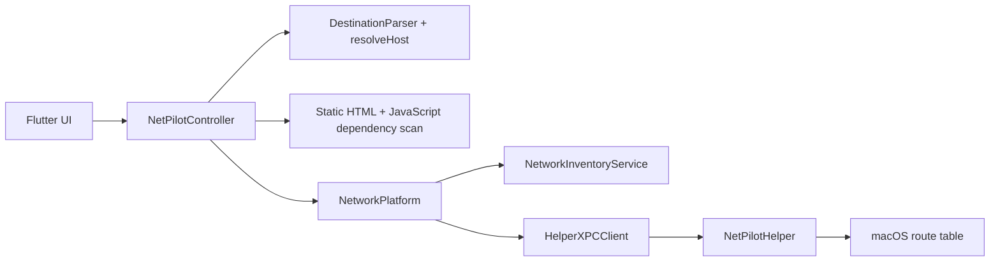

# NetPilot Desktop — Handoff

> **Keep this file current.** Any agent or developer that changes architecture, file layout, native contracts, models, or capabilities must update this document in the same change. See [`AGENTS.md`](AGENTS.md).

## Product goal

NetPilot helps developers who are connected to **Wi‑Fi (internet)** and **company LAN (intranet)** at the same time. Default macOS service order may send all traffic via Wi‑Fi, so intranet hosts become unreachable. NetPilot lets the user:

1. See currently active network interfaces.
2. Define destination rules (hostname / URL / IP / CIDR).
3. Force those destinations out the chosen LAN interface via specific routes — without flipping service order.
4. Pin all IPv4 TCP/UDP traffic from selected macOS apps or Windows Win32 EXEs
   to a physical Wi-Fi or Ethernet interface with per-rule block/fallback behavior.

## Scope (MVP / v1)

| In scope | Out of scope (for now) |
|---|---|
| macOS 14+, Windows 10 22H2/11 x64 | Linux, Windows ARM64 |
| IPv4 | IPv6 |
| Hostname, URL (hostname only), IPv4, CIDR | URL path-based routing |
| Route reconcile via privileged helper | TLS MITM / HTTPS path inspection |
| Local destination and application rule persistence | Cloud sync / accounts |
| Per-app TCP/UDP (including QUIC) transparent relay | ICMP, raw IP, IPv6, TLS inspection, MSIX/UWP |
| Simple desktop UI | Tray-only / menubar-only app |

## Architecture overview

```text
Flutter UI
  → NetPilotController / DestinationParser / DependencyScanner / RouteReconciler
  → MethodChannel + EventChannel
       → NetworkInventoryService (SystemConfiguration)
       → HelperXPCClient → NetPilotHelper (SMAppService / NSXPC)
            → /sbin/route (fixed argv only)
```

```text
Apps tab → AppRoutingController → appRouting Method/Event channels
  → AppInspector (code-signing integration gate)
  → OSSystemExtensionManager + NETransparentProxyManager
  → NetPilotTransparentProxy.systemextension
       → exact signing identifier + Team ID match
       → NWConnection with requiredInterface (TCP/UDP opaque relay)
```

```text
Windows Flutter Runner (unelevated)
  → Method/Event channels
  → GetAdaptersAddresses / DnsQueryEx / NotifyIpInterfaceChange
  → versioned length-prefixed named pipe (strict ACL + client path check)
  → NetPilotService.exe (LocalSystem)
       → CreateIpForwardEntry2 / DeleteIpForwardEntry2
       → transactional WFP policy at ALE_CONNECT_REDIRECT_V4
       → TCP/UDP loopback relay using IP_UNICAST_IF
  → NetPilotWfp.sys callout driver (test-signed during development)
```



## Repository map

```text
netpilot_desktop/
├── AGENTS.md
├── HANDOFF.md
├── README.md
├── pubspec.yaml
├── lib/
│   ├── main.dart
│   ├── app/
│   │   ├── netpilot_app.dart
│   │   └── theme.dart
│   ├── core/
│   │   ├── models/
│   │   │   ├── app_routing_rule.dart
│   │   │   ├── network_interface_info.dart
│   │   │   └── routing_rule.dart
│   │   ├── platform/
│   │   │   ├── app_routing_platform.dart
│   │   │   └── network_platform.dart
│   │   └── utils/
│   │       ├── destination_parser.dart
│   │       ├── dependency_scanner.dart
│   │       └── route_reconciler.dart
│   └── features/
│       ├── home/
│       │   └── home_page.dart
│       ├── app_routing/
│       │   ├── data/app_rules_repository.dart
│       │   ├── domain/app_routing_controller.dart
│       │   └── presentation/apps_view.dart
│       ├── network_interfaces/
│       │   └── presentation/interface_card.dart
│       └── routing_rules/
│           ├── data/rules_repository.dart
│           ├── domain/netpilot_controller.dart
│           └── presentation/
│               ├── rule_editor_sheet.dart
│               └── rule_tile.dart
├── test/
│   ├── destination_parser_test.dart
│   ├── dependency_scanner_test.dart
│   ├── route_reconciler_test.dart
│   ├── routing_rule_test.dart
│   ├── netpilot_controller_test.dart
│   └── widget_test.dart
└── macos/
    ├── Runner/Assets.xcassets/AppIcon.appiconset/  # NetPilot routing icon
    ├── scripts/
    │   ├── embed_helper.sh          # Build-phase: compile + embed helper
    │   └── patch_pbxproj.py         # Sanity check for native file refs
    ├── NetPilotHelper/
    │   ├── main.swift
    │   ├── HelperDelegate.swift
    │   ├── Info.plist
    │   ├── NetPilotHelper.entitlements
    │   └── com.netpilot.netpilotDesktop.helper.plist
    ├── NetPilotTransparentProxy/   # System Extension target
    │   ├── TransparentProxyProvider.swift
    │   ├── FlowRelay.swift
    │   ├── AppIdentityResolver.swift
    │   ├── InterfaceResolver.swift
    │   ├── AppRoutingConfig.swift
    │   ├── main.swift
    │   ├── Info.plist
    │   └── NetPilotTransparentProxy.entitlements
    ├── IntegrationTests/APP_ROUTING.md  # signed real-Mac acceptance gate
    ├── Runner/
    │   ├── MainFlutterWindow.swift  # Registers NetPilotPlugin
    │   ├── NetPilotPlugin.swift
    │   ├── NetworkInventoryService.swift
    │   ├── HelperXPCClient.swift
    │   ├── AppInspector.swift
    │   ├── AppRoutingManager.swift
    │   ├── AppRoutingPlugin.swift
    │   ├── NetPilotShared/
    │   │   ├── NetPilotXPCProtocol.swift
    │   │   ├── RouteSpec.swift
    │   │   └── RouteManager.swift
    │   └── *entitlements            # App Sandbox OFF for MVP networking/helper
    └── RunnerTests/
        ├── AppRoutingConfigTests.swift
        ├── RunnerTests.swift
        └── RouteManagerTests.swift
└── windows/
    ├── runner/                    # Flutter host + four native channels
    │   ├── netpilot_plugin.*
    │   ├── windows_network.*
    │   ├── windows_app_inspector.*
    │   └── service_client.*
    ├── native/
    │   ├── common/                # framed protocol, validation, WFP GUID/context
    │   ├── service/               # LocalSystem route/WFP/relay owner
    │   ├── driver/                # WFP callout source, INF, WDK project
    │   ├── maintenance/           # fixed install/repair/remove operations
    │   └── tests/                 # protocol/validation CTest
    ├── installer/                 # WiX v4 Burn bundle + MSI
    ├── scripts/                   # Test Mode, signing, build automation
    └── IntegrationTests/WFP_GATE.md
```

## Data models

### NetworkInterfaceInfo

| Field | Type | Notes |
|---|---|---|
| id | String | BSD name on macOS; adapter LUID string on Windows |
| nativeId | String | Stable BSD name or Windows adapter LUID |
| name | String | SC user-defined name |
| interfaceName | String | BSD name |
| kind | `wifi` \| `ethernet` \| `other` | Heuristic |
| ipv4Addresses | `List<String>` | |
| gateway | `String?` | |
| dnsServers | `List<String>` | |
| isDefaultRoute | bool | Primary IPv4 default |
| isActive | bool | Has IPv4 |

### DestinationKind

`hostname` | `url` | `ipv4` | `cidr`

URL → hostname only (path/query discarded). Parser checks URL scheme **before** CIDR slash.

### RoutingRule / DesiredRoute

See `lib/core/models/routing_rule.dart`. URL rules can own persisted
`RoutingSubRule` records containing a discovered hostname/IP, stable id,
enabled state, resolved IPv4 addresses, and route status. Sub-rules inherit the
parent interface and lifecycle. Desired routes carry `tag = netpilot:<ruleId>`;
sub-rule tags use `netpilot:<parentId>:sub:<subRuleId>`.

### AppRoutingRule

`AppRoutingRule` persistence is schema version 2 and includes `platform`.
macOS keeps app name/icon/path, bundle identifier, exact main/helper signing
identifiers and Team ID. Windows keeps canonical EXE path, exact WFP App ID,
optional Authenticode publisher diagnostics, signed state, and up to 200 reviewed
helper EXEs. Unsigned Win32 apps are intentionally path-only. Both platforms
store the stable native interface id, `block`/`fallback`, status, and last error.
Runtime flow/byte/error metrics are returned separately by the provider.

## Persistence

- App support dir / `netpilot_rules.json` via `path_provider`
- App support dir / `netpilot_app_rules.json` stores version 2 application
  routing state (`masterEnabled` plus platform identities and rules). Version 1
  macOS objects and a legacy bare rule list still load without manual migration.
- The pending configuration hash is SHA-256 over canonical provider-relevant
  fields. The applied hash is mirrored in
  `NETransparentProxyManager.protocolConfiguration.providerConfiguration`.
- `FileRulesRepository` / `MemoryRulesRepository` (tests)
- Rule JSON now includes `subRules`, `dependencyScanStatus`, and
  `dependencyScanError`. Missing fields default to an empty/not-applicable scan,
  so existing rule files load without migration.
- `path_provider_foundation` 2.6.0 uses Dart native assets/FFI on macOS;
  it no longer registers a Flutter plugin or installs a CocoaPod. Flutter
  generates the native asset build integration; the JSON persistence format
  and NetPilot's MethodChannel/XPC contracts are unchanged.

## Platform contracts

### MethodChannel: `com.netpilot.netpilotDesktop/network`

| Method | Args | Result |
|---|---|---|
| `listInterfaces` | — | `List<Map>` |
| `resolveHost` | `{ host, interfaceId? }` | `{ ips: List<String> }` |
| `getHelperStatus` | — | `{ installed, enabled, status, message? }` |
| `installHelper` | — | status map (+ `ok` when possible) |
| `reconcileRoutes` | `{ desired: List<RouteSpec> }` | `{ ok, added, removed, errors }` |
| `windowAction` | `{ action: close, minimize, or zoom }` | — |

### EventChannel: `com.netpilot.netpilotDesktop/networkEvents`

Emits `{ type: 'interfacesChanged' }` on SCDynamicStore changes.

### MethodChannel: `com.netpilot.netpilotDesktop/appRouting`

| Method | Args | Result |
|---|---|---|
| `selectApplication` | — | app descriptor with signing/team/helper identities and icon, or null |
| `getStatus` | — | platform, routing engine/service/driver/proxy status, reboot/Test Mode, applied hash, global and per-rule metrics |
| `requestExtensionActivation` | — | status; may require approval in System Settings |
| `applyAndRestart` | `{ masterEnabled, rules, configurationHash }` | updated status |
| `getDiagnostics` | — | bounded `[NetPilot App Routing]` log lines |

### EventChannel: `com.netpilot.netpilotDesktop/appRoutingEvents`

Emits `reconnecting`, `extensionStatusChanged`, and `proxyStatusChanged`
events. Dart refreshes the native status and runtime metrics after each event.
While Apps is listening, Runner polls provider status every two seconds; bounded
provider flow logs are forwarded once into the Runner/Flutter terminal.

### XPC (app ↔ helper)

- Mach service: `com.netpilot.netpilotDesktop.helper`
- Protocol methods: `ping`, `listManagedRoutes`, `reconcileDesired`
- Launchd plist name: `com.netpilot.netpilotDesktop.helper.plist`
- Helper binary path in app: `Contents/MacOS/NetPilotHelper`
- Plist embedded at: `Contents/Library/LaunchDaemons/`

**Security:** Destination must be IPv4 CIDR; gateway optional IPv4; interface BSD-like name; tag must start with `netpilot:`. Fixed `/sbin/route` argv only. Managed inventory persisted under `/Library/Application Support/NetPilot/managed_routes.json`.

### Windows service protocol

- Pipe: `\\.\pipe\NetPilotService.v1`; 12-byte magic/version/operation/length
  header followed by a bounded binary payload (4 MB maximum).
- Fixed operations: `ping`, `status`, `reconcileRoutes`, `applyAppRouting`,
  `restartProxy`, `diagnostics`, and installer-only `cleanup`.
- Pipe ACL permits LocalSystem, Administrators, and interactive users. The
  service additionally resolves the client PID and accepts only
  `netpilot_desktop.exe` or `NetPilotMaintenance.exe` in the service's own
  canonical installation directory.
- The service revalidates CIDR, gateway, route tag, adapter LUID, canonical EXE
  path, and WFP App ID. It never accepts commands or arbitrary shell text.
- Managed route state is `%ProgramData%\NetPilot\managed_routes.json`; stale
  entries are removed at service startup and all system state is deleted on
  uninstall. User JSON in Application Support/AppData is preserved.

Route argv: gateway routes use `-net <CIDR> <gateway> -ifp <BSD-name>:`;
the trailing colon encodes the interface name for macOS `link_addr`. Direct
routes without a gateway use `-net <CIDR> -interface <BSD-name>`. Add and delete
use the same selectors. Routes remain unscoped so ordinary app traffic can
match them regardless of the default interface. Do not combine a gateway with
`-iface`: macOS parses the following interface name as another IP address.

## Privileged helper build

Runner build phase **Embed NetPilot Helper** runs `macos/scripts/embed_helper.sh`, which `swiftc`-compiles helper sources into the app bundle and copies the launchd plist. Install at runtime via `SMAppService.daemon(plistName:)`.

Requires matching Team ID signatures on app + helper for real privileged install.
The build script embeds the helper Info.plist and signs the binary with its
entitlements whenever Xcode provides a signing identity; signing failures stop
the build. Without an Apple Development identity, macOS rejects the daemon with
`OS_REASON_CODESIGNING`; inventory + UI still work but routes cannot be applied.

Native helper changes require a full app rebuild. Helper status includes a live
XPC ping, so a registered but unreachable daemon is reported as `unreachable`
instead of `enabled`. Settings exposes Install / Repair, which unregisters a
stale enabled service, registers the helper from the current app bundle, and
reapplies rules after a successful ping.

## Signing & entitlements

- App: `com.netpilot.netpilotDesktop`
- Helper: `com.netpilot.netpilotDesktop.helper`
- Transparent Proxy System Extension:
  `com.netpilot.netpilotDesktop.TransparentProxy`
- Deployment target: **macOS 14.0**
- App Sandbox disabled in Debug/Release entitlements for MVP (network inventory + helper install)
- Runner has `com.apple.developer.system-extension.install` and the
  `app-proxy-provider-systemextension` Network Extension entitlement. The
  sandboxed System Extension has the same Network Extension entitlement plus
  network client/server access. A real Apple Developer Team and provisioning
  profiles containing this entitlement are mandatory for signed install/run;
  no Team ID or machine-local signing identity is committed.
- The native title bar and traffic-light controls are hidden. Flutter renders
  working Close / Minimize / Zoom controls through `windowAction`. The controls
  use a compact Liquid Glass-inspired capsule with adaptive light/dark material,
  gloss, depth, and hover/press feedback.
- Windows x64 development uses Test Mode plus a local test code-signing
  certificate for `NetPilotWfp.sys` and its CAT. The Flutter Runner stays
  unelevated; WiX Setup/Maintenance is the only UAC entry point. Public packages
  require Microsoft Hardware Dashboard driver signing. No certificate or
  thumbprint is committed.

## UI map

- Home: 1180×760 initial desktop window (980×640 minimum) with Rules / Apps / Networks / Settings tabs;
  each tab owns its scrollable content. Rules includes a collapsible Diagnostics
  panel; Settings contains the light/dark theme switch. Dark mode is default
  with green primary actions on neutral graphite surfaces.
- Add/Edit sheet: destination, label, interface, resolve preview, save & apply;
  saving a URL applies the parent first and then displays dependency scan progress
- URL rule cards expose an expandable discovered-dependencies list with an
  independent toggle, resolved IPs, and status for every sub-rule
- Helper banner with Install when not enabled
- Route reconciliation writes desired routes, result counts, errors, and thrown
  exceptions to the `flutter run` terminal with the `[NetPilot]` prefix.
- Dependency discovery writes scanned URLs, discovered hosts, failures, and
  route conflicts to the terminal with the same prefix.
- Apps shows extension/proxy state, master switch, signed `.app` picker,
  physical interface and block/fallback editors, helper count, per-rule flow and
  byte metrics, errors, Pending Changes, and manual **Apply & Restart Proxy**.
- On Windows, Apps selects `.exe`, displays Authenticode/publisher or a visible
  unsigned path-only warning, and asks the user to review discovered helper
  candidates. Settings reports Windows Service, WFP Driver, Test Mode, reboot,
  and Repair. Windows retains its native title bar and taskbar controls.

## Per-app transparent proxy

`AppInspector` is the first integration gate: it uses Security.framework to
extract an app's exact signing identifier and Team ID and discovers signed
`.app`/`.xpc` helpers under standard bundle locations. A rule is not created if
this metadata is unavailable. PID matching and privileged shell fallbacks are
forbidden.

The System Extension receives outbound IPv4 TCP and UDP flows. Unselected flows
return `false` to macOS. Selected flows are relayed without payload inspection
through `NWConnection`; `NWParameters.requiredInterface` pins each connection
to the chosen active Wi-Fi or Ethernet interface. TCP streams and UDP datagrams
(including QUIC transport) are opaque. If an interface is unavailable, `block`
closes the flow with a network-unavailable error and `fallback` returns `false`.
App matching takes precedence over destination routes because selected relay
connections explicitly require their interface; other apps continue to use the
normal routing table.

Edits persist immediately but do not change live traffic. Apply validates
signing identifiers and physical interfaces, blocks one signing identifier from
targeting different interfaces, mirrors the configuration into Network
Extension preferences, and restarts the proxy. Existing proxy flows can reconnect.
Logs contain identity/interface/protocol/decision/errors but never payload data.

## URL dependency discovery

Saving an HTTP(S) URL first persists and applies its parent hostname so the scan
uses the selected route. `HttpDependencyScanner` then follows up to 5 redirects,
parses resource-bearing HTML elements and inline JavaScript request expressions,
and downloads up to 20 same-origin JavaScript files. Each request has a 10-second
timeout and a scan can consume at most 10 MB. Ordinary page links are ignored.
JavaScript is analyzed statically and never executed; authenticated pages do not
share browser cookies.

All valid discovered HTTP(S) hostname/IP dependencies are enabled automatically.
A successful edit replaces the previous discovery set while retaining enabled
state and stable ids for destinations that remain. A failed scan persists and
applies only the parent rule. DNS Refresh resolves existing parents and children
without rescanning page content.

Before native reconciliation, equivalent routes to the same CIDR/interface are
de-duplicated. An exact CIDR requested through different interfaces is excluded,
removed if previously managed, and reported on every affected parent/sub-rule;
other non-conflicting routes still apply.

## Testing

Toolchain baseline: **Flutter 3.47.4 stable / Dart 3.13.3**. Minimum SDK
constraints are declared in `pubspec.yaml`; commit `pubspec.lock` for reproducible
package resolution. CocoaPods and Runner both target macOS 14.0.

```bash
PUB_HOSTED_URL=https://pub.dev flutter pub get   # if corporate mirror fails
flutter analyze
flutter test
flutter build macos --debug
```

XCTest: `RouteSpec` validation + `RouteManager` reconcile argv and per-app exact
identity/helper matching (`AppRoutingConfigTests`). To compile before a Team and
profile are configured, use
`xcodebuild ... CODE_SIGNING_ALLOWED=NO build`; this does not exercise install.
The route parser regression uses `/sbin/route -n -d -v get` (read-only debug
mode) to check gateway flags and interface encoding without mutating routes.

Windows source/build gates are in `windows/scripts`. `build_windows.ps1` runs
Flutter analyze/tests/build, MSBuild x64 for the WDK driver, Inf2Cat, SignTool,
and CTest before producing installer inputs. The mandatory real-network gate is
documented in `windows/IntegrationTests/WFP_GATE.md` and covers exact App ID,
TCP, UDP, QUIC, block/fallback, two adapters, restart, sleep/resume, Driver
Verifier, stress, and installer lifecycle on Windows 11 VM and physical Windows
10/11. This macOS host has no Windows hypervisor/SDK/WDK, so those native gates
remain unexecuted until the Windows VM is available.

## Known limitations

- Hostname → IP: CDN/shared IPs may mis-route unrelated hosts.
- Dependency discovery is static: computed runtime URLs, browser-only requests,
  authenticated content, and URLs hidden by obfuscated JavaScript may be missed.
- `resolveHost` uses system DNS (interface-scoped DNS reserved for later).
- Helper install needs code signing + user Login Items approval.
- System Extension activation and end-to-end TCP/UDP/QUIC egress verification
  require an Apple Development/Developer ID certificate and provisioning
  profiles with Network Extension approval. The current machine has no valid
  identity, so only the unsigned compile gate and unit tests can run here.
- Per-app DNS is best effort because system-daemon DNS cannot always be
  attributed to the originating app. ICMP/raw IP, IPv6, standalone scripts and
  executables, and VPN/`utun` stacking are outside this phase.
- No path-level URL routing.
- Windows supports Win32 EXEs only. Unsigned EXEs remain matched after the file
  at the same canonical path is replaced; the UI documents this path-only risk.
- Windows driver/service/installer and relay source are implemented but cannot
  be accepted until the mandatory signed VM gate verifies UDP/QUIC redirect
  context behavior on Windows 10/11. No PID matching, injection, or third-party
  driver fallback is permitted if that gate fails.

## Architecture decisions

| Decision | Choice | Why |
|---|---|---|
| Routing key | IP / CIDR after resolve | OS routes are L3 |
| Privilege | Helper + XPC + SMAppService | Persistent, least privilege |
| Service order | Unchanged | Specific routes override default |
| URL handling | Hostname only | No TLS MITM |
| URL dependencies | Static HTML/JS scan on Save | Finds related hosts without intercepting browser traffic |
| Route conflicts | Block exact CIDR across interfaces | macOS cannot install one destination through two gateways |
| Helper embed | Build-phase `swiftc` | Avoid fragile extra Xcode target with Flutter/Pods |
| Per-app routing | `NETransparentProxyProvider` System Extension | Supports unmanaged personal Macs; App Proxy configuration otherwise requires MDM |
| App identity | Exact signing identifier + Team ID | Stable identity without unsafe PID-only matching |
| Per-app egress | `NWConnection.requiredInterface` | Pins TCP/UDP relay connections to physical Wi-Fi/Ethernet |
| App changes | Explicit Apply & Restart | Keeps edits pending and makes flow reevaluation visible |
| Windows privilege | LocalSystem service + WFP callout | Keeps Flutter unelevated and constrains mutations |
| Windows app identity | Canonical EXE path + exact WFP App ID | Matches ALE identity; signed publisher is discovery-only |
| Windows installer | WiX v4 Burn + MSI + fixed maintenance executable | UAC, repair, rollback, driver/service lifecycle |

## Feature status

| Feature | Status |
|---|---|
| Handoff / agent docs | Done |
| Flutter feature layout | Done |
| Interface inventory (macOS) | Done |
| Rule CRUD + persistence | Done |
| Destination parser + resolve | Done |
| Privileged helper + XPC + embed | Done (signing TBD per machine) |
| Route reconcile | Done |
| URL dependency discovery + sub-rules | Done |
| Per-app UI, persistence, native bridge, System Extension | Done (signed integration pending Team/profile) |
| Desktop UI | Done |
| Windows Flutter models/UI/native bridge | Done |
| Windows inventory/DNS/destination routes | Implemented; Windows build/integration pending |
| Windows WFP driver/service/TCP-UDP relay | Implemented, including secured service-PID registration and TCP/UDP redirect-record propagation; signed integration gate pending |
| Windows WiX installer and test-sign scripts | Implemented; Windows lifecycle test pending |
| IPv6 | Not started |

## Changelog

- 2026-09-20: Windows installer packaging now generates a WiX component for every published file and its directory, replacing unsupported WiX v4 `Files` harvesting inside a component group; MSI build failures stop before bootstrapper construction.
- 2026-09-20: Pinned the Windows CI WiX tool and bootstrapper extension to the same concrete 4.0.6 version because WiX rejects wildcard extension versions.
- 2026-09-20: Bounded the Windows driver CI signing step and added phase markers. CI now inspects the test signatures without importing the ephemeral certificate into Windows trust stores, which had blocked headless builds; testers must still trust the public certificate on their own test machine.
- 2026-09-20: Disabled WDK's implicit test signing during MSBuild; CI signs the built SYS and CAT explicitly with SHA-256 after catalog generation.
- 2026-09-20: Windows CI emits actionable driver and catalog tool failures as job annotations, so WDK build failures can be diagnosed without an interactive log session.
- 2026-09-20: Exported the C ABI for the WFP driver's `DriverEntry` so the WDK linker can resolve the kernel entry point.
- 2026-09-20: CI now exports the per-build public test-signing certificate with Windows artifacts and trusts it only on the ephemeral runner for signature verification; Windows test-machine instructions specify certificate import before installer use.
- 2026-09-20: Removed the user-mode CRT `stdint.h` dependency from the shared WFP redirect context; fixed-width aliases and compile-time layout checks preserve its 24-byte driver/service ABI.
- 2026-09-20: Set the WFP driver's NDIS 6.30 header mode so `NET_BUFFER_LIST` is declared, and detached INF packaging from MSBuild because the hosted WDK lacks `InfVerif.dll`; the CI packaging stage retains explicit `Inf2Cat` validation.
- 2026-09-20: Corrected WDK driver compilation by loading NDIS declarations before WFP, matching the classify and notify callback signatures, passing a UNICODE_STRING device SDDL, and treating modified-layer application as a void operation. WFP owns redirect context memory after it is applied.
- 2026-09-18: Restored the Windows NetIO declarations after `iphlpapi.h` in the runner and service headers, and made Win32 string buffer conversions explicit for clean MSVC compilation.
- 2026-09-18: Removed the remaining MSVC `/WX` conversion failures in the relay and runner and included the Win32 shell API declaration used by maintenance repair.
- 2026-09-18: Added the Winsock IP type header before IP Helper/NetIO declarations so modern route and interface APIs are visible to MSVC.
- 2026-09-18: Removed an empty custom INF timestamp override that caused WDK `stampinf.exe` to receive an invalid version argument in CI.
- 2026-09-18: Moved CI INF validation out of the driver MSBuild target and into the explicit `Inf2Cat` packaging step, avoiding the hosted runner's missing `InfVerif.dll` while preserving catalog validation.

- **2026-09-18** — Added Windows 10 22H2/11 x64 implementation on `codex/windows-parity`: platform-neutral schema v2 identities and stable adapter ids; Windows Method/Event channels; physical adapter inventory, interface-scoped DNS and notifications; canonical EXE/AuthentiCode/helper/icon discovery; a bounded named-pipe protocol; LocalSystem route/WFP/relay service; primitive WFP connect-redirect driver package; secured service-PID registration; loop-safe redirect state checks; TCP/UDP redirect-record propagation and source/interface-bound relay with metrics; block/fallback and atomic apply; native Windows title bar/settings; NetPilot multi-resolution ICO; fixed-operation maintenance executable; WiX Burn/MSI setup with repair/rollback/uninstall; test-sign/build scripts, CTest and mandatory VM/physical acceptance documentation. Flutter analyze and all 33 Dart/widget tests pass on macOS. Windows SDK/WDK build, signed driver install, UDP/QUIC gate, and installer lifecycle remain pending because this host has no Windows VM/hypervisor.
- **2026-09-18** — Added a Windows GitHub Actions test-build pipeline that analyzes and tests Flutter, compiles the Windows runner/service, runs native protocol tests, builds and test-signs the WFP driver, creates the WiX MSI/Burn installer, and publishes portable and installer artifacts.
- **2026-09-18** — Fixed the first MSVC build gate: user-mode IP Helper headers now enter through `iphlpapi.h`, Shell argument declarations are explicit, warning-clean conversions preserve `/WX`, and native protocol checks remain active in Release builds.

- **2026-09-17** — Added Phase 2 per-app split tunneling: Apps UI and versioned persistence, pending/applied hashes, signed `.app` and helper inspection, conflict/physical-interface validation, System Extension activation/status channels, and a `NETransparentProxyProvider` target that matches exact app identity and relays opaque IPv4 TCP/UDP/QUIC with `NWParameters.requiredInterface`. Added block/fallback policies, per-rule flow/byte/error diagnostics, manual Apply & Restart, host/extension entitlements, Dart tests, and Swift identity matching tests. Unsigned native compilation passes; signed installation and live egress testing remain gated on an Apple Team/profile with Network Extension permission.
- **2026-09-17** — Added automatic URL dependency discovery and persisted Sub-rules. URL Save now applies the parent route, scans HTML/inline JS/same-origin JS within bounded limits, resolves and applies discovered hosts, exposes per-child toggles and status, preserves child choices on resave, and falls back to the parent on scan failure. Route planning now de-duplicates equivalent CIDRs and blocks exact cross-interface conflicts with diagnostics. Existing JSON remains backward compatible.
- **2026-09-17** — Restyled the custom Close / Minimize / Zoom controls for the current macOS design language with an adaptive blurred glass capsule, dimensional color treatment, clear symbols, and hover/press motion; native window actions are unchanged.
- **2026-09-17** — Fixed false `enabled` helper status and eight-second timeouts with a live XPC health check, immediate XPC error completion, and a working Install / Repair flow that reapplies rules. Fixed Scrollbar controller attachment, moved theme switching exclusively to Settings, and added custom Flutter Close / Minimize / Zoom controls backed by the native MethodChannel.
- **2026-09-17** — Rebuilt the desktop UI from approved design 3: fixed-size tabbed layout, independent Rules and Networks scrolling, Settings theme switch, and in-app Diagnostics panel. The dark theme primary color is now NetPilot green while surfaces remain neutral graphite.
- **2026-09-17** — Added `[NetPilot]` route reconciliation diagnostics to the Flutter terminal, hid the native macOS title bar and traffic-light controls, changed the dark palette to neutral graphite with a muted blue accent, and bumped the app build to 1.0.1+2 so macOS refreshes the Dock icon.
- **2026-09-17** — Replaced the macOS app icon with a custom NetPilot route-and-arrow mark and generated all required AppIcon sizes (16–1024 px).
- **2026-09-17** — Added Material light and dark themes; the application defaults to dark mode. Theme-aware surface colors keep cards and form fields readable in both modes.
- **2026-09-17** — Fixed `route: bad address: en8` by separating gateway routes (`-ifp <name>:`) from direct interface routes (`-interface <name>`), matching add/delete selectors, and adding native argv plus real macOS parser regression tests. All 6 targeted native tests and `flutter build macos --debug` passed; live privileged routing was not exercised. Helper/XPC payloads and persisted route format are unchanged.
- **2026-09-17** — Upgraded to Flutter 3.47.4 stable / Dart 3.13.3, refreshed package locks and flutter_lints 6, migrated deprecated dropdown initialization and new Dart lint fixes, aligned CocoaPods with macOS 14.0, and regenerated native plugin integration for path_provider_foundation's FFI implementation. Cleared stale generated Swift package references with `flutter clean`. `flutter analyze`, all 11 Flutter tests, and a clean `flutter build macos --debug` passed.
- **2026-09-17** — MVP implemented: Flutter UI/controller, macOS inventory plugin, privileged helper embed script, handoff docs. `flutter analyze` / `flutter test` / `flutter build macos --debug` verified.
- **2026-09-17** — Initial handoff drafted; implementation started.
