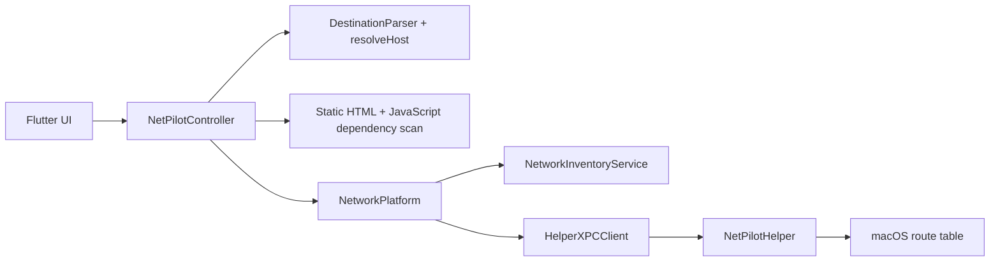

# NetPilot Desktop — Handoff

> **Keep this file current.** Any agent or developer that changes architecture, file layout, native contracts, models, or capabilities must update this document in the same change. See [`AGENTS.md`](AGENTS.md).

This is an operational handoff, not a commit log. Keep contracts, decisions,
verified state, remaining gates, and the shortest path to reproduce a failure
here. Consolidate routine fixes into milestones; use Git history for details.
The original `AGENTS.md` says Windows is deferred, but the user's later
explicit Windows parity request superseded that scope note for this branch.

## Current state and next gate (2026-09-20)

- Work is on `codex/windows-parity`. Windows GitHub Actions run
  [#18](https://github.com/mahanpyk/netpilot_desktop/actions/runs/35528714065)
  succeeded at commit `58294f8`: Flutter analyze/tests, Release app and native
  service build, CTest, WDK driver build, Inf2Cat, test signing, WiX MSI/Burn,
  portable ZIP, and artifact upload. This is a **build gate**, not evidence that
  driver installation or routing works on a live Windows machine.
- The `NetPilot-windows-x64-test` Actions artifact contains `NetPilotSetup.exe`,
  `NetPilot.msi`, the portable ZIP, and `NetPilotDriverTest.cer`. It expires
  after 14 days. Each CI run creates a new signing certificate; use the `.cer`
  from the same artifact as its installer. See `windows/README.md` for Test Mode
  and certificate trust steps. Use a disposable Windows VM or test machine;
  this is not a production release.
- **Next:** run `windows/IntegrationTests/WFP_GATE.md` on a snapshot-backed
  Windows 11 x64 VM with two real/bridged adapters. Begin with install, service
  and driver status, exact App ID, and TCP/UDP egress. Continue to QUIC,
  block/fallback, coexistence with destination rules, restart, and lifecycle
  tests. Repeat acceptance on physical Windows 10/11. Fix failures before
  calling Windows parity complete.
- macOS per-app System Extension still needs a Team/profile with Network
  Extension entitlement and signed live testing. Unsigned build/unit tests are
  not a substitute for that gate.

### macOS on-device check (2026-09-21)

- Two local Debug bundles were launched: the older `build/macos/Build/Products/Debug`
  app (Rules/Networks/Settings) reports the route helper enabled; the newer
  Xcode DerivedData Debug app (with Apps tab) reports **Helper not registered**,
  **System Extension setup required**, and **Proxy: unconfigured**. Their
  shared app-rule JSON currently contains zero rules, so no app flow was
  available to exercise. The old helper is running under launchd, but its
  registration does not make the newer app's helper registered.
- `systemextensionsctl list` contains no NetPilot extension. Both local bundles
  and the newer embedded Transparent Proxy have ad-hoc signatures with no Team
  ID; strict signature verification of the newer bundle/extension fails. One
  Apple Development signing identity is present, but none of the installed
  provisioning profiles is for NetPilot or carries the required Network
  Extension/System Extension entitlements. Rebuild and sign Runner, helper, and
  extension with the same Team and the required approved profile before trying
  activation. Do not interpret an unsigned Debug build as a per-app test build.
- Wi-Fi `en0` was subsequently connected alongside Ethernet `en8` and VPN
  `utun6`. The per-app feature intentionally accepts physical Wi-Fi/Ethernet,
  not VPN interfaces. After a signed install, confirm extension and proxy
  status first, then add a signed test app and verify TCP/UDP/QUIC egress.
- A clean build after connecting Wi-Fi found both physical interfaces. Xcode
  could not sign the Runner or extension: Xcode reports `No Account for Team`
  and no development provisioning profiles for either NetPilot bundle ID.
  The two old Debug `.app` bundles were removed; one newly compiled unsigned
  app remains at `build/macos/Build/Products/Debug/netpilot_desktop.app` and
  runs. In this app's UI, Rules has no saved rules, Settings reports `Helper
  not registered`, and Networks lists both `en0` and `en8`. Unsigned builds
  now return `extensionStatus=signingRequired` with an
  actionable message and cannot attempt activation or Apply & Restart. `flutter
  analyze`, all 33 Flutter tests, and an unsigned Xcode Debug build pass.
- Live checks of `ip.sheltertm.com` through `en8`, `en0`, and default VPN
  return three distinct public addresses; the page's inline and same-origin
  JavaScript fetch this shared hostname. `HttpDependencyScanner` discovers
  `ip.sheltertm.com` and `user.sheltertm.com` from the panel3 page. Browser IP
  display will follow the route for `ip.sheltertm.com`, not merely the route for
  `panel3.sheltertm.com`. Because panel2 uses the same IP endpoint, its IP
  display cannot differ from panel3 in the same browser on a single global
  destination-route table. Per-app routing could differentiate *separate apps*
  once the signed extension is operational.
- `macos/scripts/package_routes_test.sh` produces an internal, universal
  Rules-only DMG. It removes the Transparent Proxy system extension, signs the
  Runner and universal route helper with the same local Apple Development
  identity, and verifies the bundle before packaging. The helper now restricts
  XPC clients to `com.netpilot.netpilotDesktop` signed by its own Team ID.
  This package is intentionally not a public release: Apple Development signing
  is rejected by Gatekeeper on another Mac unless that development identity is
  trusted there. Portable distribution still requires Developer ID Application
  signing and notarization. The Rules-only UI reports App Routing unavailable.
- `.github/workflows/release.yml` is the tag-triggered test-release gate.
  `vMAJOR.MINOR.PATCH[-suffix]` tags run the existing Windows build as a reusable
  workflow plus macOS analyze/tests and a signed Rules-only DMG build. Only
  after both jobs succeed does it publish a GitHub prerelease with both
  platforms' assets and SHA-256 checksums. The macOS job needs repository
  secrets `MACOS_CERT_P12_BASE64` and `MACOS_CERT_P12_PASSWORD`; without them
  it fails closed. Neither secrets nor a live tag run have been configured or
  verified yet. Do not tag a release expecting it to succeed until the secrets
  are set. The Windows driver remains ephemeral test-signed, with its matching
  public certificate included in each prerelease.

## Product goal

NetPilot helps developers who are connected to **Wi‑Fi (internet)** and **company LAN (intranet)** at the same time. Default macOS service order may send all traffic via Wi‑Fi, so intranet hosts become unreachable. NetPilot lets the user:

1. See currently active network interfaces.
2. Define destination rules (hostname / URL / IP / CIDR).
3. Force those destinations out the chosen LAN interface via specific routes — without flipping service order.
4. Pin all IPv4 TCP/UDP traffic from selected macOS apps or Windows Win32 EXEs
   to a physical Wi-Fi or Ethernet interface with per-rule block/fallback behavior.

## Scope (MVP / v1)

| In scope | Out of scope (for now) |
|---|---|
| macOS 14+, Windows 10 22H2/11 x64 | Linux, Windows ARM64 |
| IPv4 | IPv6 |
| Hostname, URL (hostname only), IPv4, CIDR | URL path-based routing |
| Route reconcile via privileged helper | TLS MITM / HTTPS path inspection |
| Local destination and application rule persistence | Cloud sync / accounts |
| Per-app TCP/UDP (including QUIC) transparent relay | ICMP, raw IP, IPv6, TLS inspection, MSIX/UWP |
| Simple desktop UI | Tray-only / menubar-only app |

## Architecture overview

```text
Flutter UI
  → NetPilotController / DestinationParser / DependencyScanner / RouteReconciler
  → MethodChannel + EventChannel
       → NetworkInventoryService (SystemConfiguration)
       → HelperXPCClient → NetPilotHelper (SMAppService / NSXPC)
            → /sbin/route (fixed argv only)
```

```text
Apps tab → AppRoutingController → appRouting Method/Event channels
  → AppInspector (code-signing integration gate)
  → OSSystemExtensionManager + NETransparentProxyManager
  → NetPilotTransparentProxy.systemextension
       → exact signing identifier + Team ID match
       → NWConnection with requiredInterface (TCP/UDP opaque relay)
```

```text
Windows Flutter Runner (unelevated)
  → Method/Event channels
  → GetAdaptersAddresses / DnsQueryEx / NotifyIpInterfaceChange
  → versioned length-prefixed named pipe (strict ACL + client path check)
  → NetPilotService.exe (LocalSystem)
       → CreateIpForwardEntry2 / DeleteIpForwardEntry2
       → transactional WFP policy at ALE_CONNECT_REDIRECT_V4
       → TCP/UDP loopback relay using IP_UNICAST_IF
  → NetPilotWfp.sys callout driver (test-signed during development)
```



## Repository map

```text
netpilot_desktop/
├── AGENTS.md
├── HANDOFF.md
├── README.md
├── pubspec.yaml
├── lib/
│   ├── main.dart
│   ├── app/
│   │   ├── netpilot_app.dart
│   │   └── theme.dart
│   ├── core/
│   │   ├── models/
│   │   │   ├── app_routing_rule.dart
│   │   │   ├── network_interface_info.dart
│   │   │   └── routing_rule.dart
│   │   ├── platform/
│   │   │   ├── app_routing_platform.dart
│   │   │   └── network_platform.dart
│   │   └── utils/
│   │       ├── destination_parser.dart
│   │       ├── dependency_scanner.dart
│   │       └── route_reconciler.dart
│   └── features/
│       ├── home/
│       │   └── home_page.dart
│       ├── app_routing/
│       │   ├── data/app_rules_repository.dart
│       │   ├── domain/app_routing_controller.dart
│       │   └── presentation/apps_view.dart
│       ├── network_interfaces/
│       │   └── presentation/interface_card.dart
│       └── routing_rules/
│           ├── data/rules_repository.dart
│           ├── domain/netpilot_controller.dart
│           └── presentation/
│               ├── rule_editor_sheet.dart
│               └── rule_tile.dart
├── test/
│   ├── destination_parser_test.dart
│   ├── dependency_scanner_test.dart
│   ├── route_reconciler_test.dart
│   ├── routing_rule_test.dart
│   ├── netpilot_controller_test.dart
│   └── widget_test.dart
└── macos/
    ├── Runner/Assets.xcassets/AppIcon.appiconset/  # NetPilot routing icon
    ├── scripts/
    │   ├── embed_helper.sh          # Build-phase: compile + embed helper
    │   └── patch_pbxproj.py         # Sanity check for native file refs
    ├── NetPilotHelper/
    │   ├── main.swift
    │   ├── HelperDelegate.swift
    │   ├── Info.plist
    │   ├── NetPilotHelper.entitlements
    │   └── com.netpilot.netpilotDesktop.helper.plist
    ├── NetPilotTransparentProxy/   # System Extension target
    │   ├── TransparentProxyProvider.swift
    │   ├── FlowRelay.swift
    │   ├── AppIdentityResolver.swift
    │   ├── InterfaceResolver.swift
    │   ├── AppRoutingConfig.swift
    │   ├── main.swift
    │   ├── Info.plist
    │   └── NetPilotTransparentProxy.entitlements
    ├── IntegrationTests/APP_ROUTING.md  # signed real-Mac acceptance gate
    ├── Runner/
    │   ├── MainFlutterWindow.swift  # Registers NetPilotPlugin
    │   ├── NetPilotPlugin.swift
    │   ├── NetworkInventoryService.swift
    │   ├── HelperXPCClient.swift
    │   ├── AppInspector.swift
    │   ├── AppRoutingManager.swift
    │   ├── AppRoutingPlugin.swift
    │   ├── NetPilotShared/
    │   │   ├── NetPilotXPCProtocol.swift
    │   │   ├── RouteSpec.swift
    │   │   └── RouteManager.swift
    │   └── *entitlements            # App Sandbox OFF for MVP networking/helper
    └── RunnerTests/
        ├── AppRoutingConfigTests.swift
        ├── RunnerTests.swift
        └── RouteManagerTests.swift
└── windows/
    ├── runner/                    # Flutter host + four native channels
    │   ├── netpilot_plugin.*
    │   ├── windows_network.*
    │   ├── windows_app_inspector.*
    │   └── service_client.*
    ├── native/
    │   ├── common/                # framed protocol, validation, WFP GUID/context
    │   ├── service/               # LocalSystem route/WFP/relay owner
    │   ├── driver/                # WFP callout source, INF, WDK project
    │   ├── maintenance/           # fixed install/repair/remove operations
    │   └── tests/                 # protocol/validation CTest
    ├── installer/                 # WiX v4 Burn bundle + MSI
    ├── scripts/                   # Test Mode, signing, build automation
    └── IntegrationTests/WFP_GATE.md
```

## Data models

### NetworkInterfaceInfo

| Field | Type | Notes |
|---|---|---|
| id | String | BSD name on macOS; adapter LUID string on Windows |
| nativeId | String | Stable BSD name or Windows adapter LUID |
| name | String | SC user-defined name |
| interfaceName | String | BSD name |
| kind | `wifi` \| `ethernet` \| `other` | Heuristic |
| ipv4Addresses | `List<String>` | |
| gateway | `String?` | |
| dnsServers | `List<String>` | |
| isDefaultRoute | bool | Primary IPv4 default |
| isActive | bool | Has IPv4 |

### DestinationKind

`hostname` | `url` | `ipv4` | `cidr`

URL → hostname only (path/query discarded). Parser checks URL scheme **before** CIDR slash.

### RoutingRule / DesiredRoute

See `lib/core/models/routing_rule.dart`. URL rules can own persisted
`RoutingSubRule` records containing a discovered hostname/IP, stable id,
enabled state, resolved IPv4 addresses, and route status. Sub-rules inherit the
parent interface and lifecycle. Desired routes carry `tag = netpilot:<ruleId>`;
sub-rule tags use `netpilot:<parentId>:sub:<subRuleId>`.

### AppRoutingRule

`AppRoutingRule` persistence is schema version 2 and includes `platform`.
macOS keeps app name/icon/path, bundle identifier, exact main/helper signing
identifiers and Team ID. Windows keeps canonical EXE path, exact WFP App ID,
optional Authenticode publisher diagnostics, signed state, and up to 200 reviewed
helper EXEs. Unsigned Win32 apps are intentionally path-only. Both platforms
store the stable native interface id, `block`/`fallback`, status, and last error.
Runtime flow/byte/error metrics are returned separately by the provider.

## Persistence

- App support dir / `netpilot_rules.json` via `path_provider`
- App support dir / `netpilot_app_rules.json` stores version 2 application
  routing state (`masterEnabled` plus platform identities and rules). Version 1
  macOS objects and a legacy bare rule list still load without manual migration.
- The pending configuration hash is SHA-256 over canonical provider-relevant
  fields. The applied hash is mirrored in
  `NETransparentProxyManager.protocolConfiguration.providerConfiguration`.
- `FileRulesRepository` / `MemoryRulesRepository` (tests)
- Rule JSON now includes `subRules`, `dependencyScanStatus`, and
  `dependencyScanError`. Missing fields default to an empty/not-applicable scan,
  so existing rule files load without migration.
- `path_provider_foundation` 2.6.0 uses Dart native assets/FFI on macOS;
  it no longer registers a Flutter plugin or installs a CocoaPod. Flutter
  generates the native asset build integration; the JSON persistence format
  and NetPilot's MethodChannel/XPC contracts are unchanged.

## Platform contracts

### MethodChannel: `com.netpilot.netpilotDesktop/network`

| Method | Args | Result |
|---|---|---|
| `listInterfaces` | — | `List<Map>` |
| `resolveHost` | `{ host, interfaceId? }` | `{ ips: List<String> }` |
| `getHelperStatus` | — | `{ installed, enabled, status, message? }` |
| `installHelper` | — | status map (+ `ok` when possible) |
| `reconcileRoutes` | `{ desired: List<RouteSpec> }` | `{ ok, added, removed, errors }` |
| `windowAction` | `{ action: close, minimize, or zoom }` | — |

### EventChannel: `com.netpilot.netpilotDesktop/networkEvents`

Emits `{ type: 'interfacesChanged' }` on SCDynamicStore changes.

### MethodChannel: `com.netpilot.netpilotDesktop/appRouting`

| Method | Args | Result |
|---|---|---|
| `selectApplication` | — | app descriptor with signing/team/helper identities and icon, or null |
| `getStatus` | — | platform, routing engine/service/driver/proxy status, reboot/Test Mode, applied hash, global and per-rule metrics |
| `requestExtensionActivation` | — | status; may require approval in System Settings |
| `applyAndRestart` | `{ masterEnabled, rules, configurationHash }` | updated status |
| `getDiagnostics` | — | bounded `[NetPilot App Routing]` log lines |

### EventChannel: `com.netpilot.netpilotDesktop/appRoutingEvents`

Emits `reconnecting`, `extensionStatusChanged`, and `proxyStatusChanged`
events. Dart refreshes the native status and runtime metrics after each event.
While Apps is listening, Runner polls provider status every two seconds; bounded
provider flow logs are forwarded once into the Runner/Flutter terminal.

### XPC (app ↔ helper)

- Mach service: `com.netpilot.netpilotDesktop.helper`
- Protocol methods: `ping`, `listManagedRoutes`, `reconcileDesired`
- Launchd plist name: `com.netpilot.netpilotDesktop.helper.plist`
- Helper binary path in app: `Contents/MacOS/NetPilotHelper`
- Plist embedded at: `Contents/Library/LaunchDaemons/`

**Security:** Destination must be IPv4 CIDR; gateway optional IPv4; interface BSD-like name; tag must start with `netpilot:`. Fixed `/sbin/route` argv only. Managed inventory persisted under `/Library/Application Support/NetPilot/managed_routes.json`.

### Windows service protocol

- Pipe: `\\.\pipe\NetPilotService.v1`; 12-byte magic/version/operation/length
  header followed by a bounded binary payload (4 MB maximum).
- Fixed operations: `ping`, `status`, `reconcileRoutes`, `applyAppRouting`,
  `restartProxy`, `diagnostics`, and installer-only `cleanup`.
- Pipe ACL permits LocalSystem, Administrators, and interactive users. The
  service additionally resolves the client PID and accepts only
  `netpilot_desktop.exe` or `NetPilotMaintenance.exe` in the service's own
  canonical installation directory.
- The service revalidates CIDR, gateway, route tag, adapter LUID, canonical EXE
  path, and WFP App ID. It never accepts commands or arbitrary shell text.
- Managed route state is `%ProgramData%\NetPilot\managed_routes.json`; stale
  entries are removed at service startup and all system state is deleted on
  uninstall. User JSON in Application Support/AppData is preserved.

Route argv: gateway routes use `-net <CIDR> <gateway> -ifp <BSD-name>:`;
the trailing colon encodes the interface name for macOS `link_addr`. Direct
routes without a gateway use `-net <CIDR> -interface <BSD-name>`. Add and delete
use the same selectors. Routes remain unscoped so ordinary app traffic can
match them regardless of the default interface. Do not combine a gateway with
`-iface`: macOS parses the following interface name as another IP address.

## Privileged helper build

Runner build phase **Embed NetPilot Helper** runs `macos/scripts/embed_helper.sh`, which `swiftc`-compiles helper sources into the app bundle and copies the launchd plist. Install at runtime via `SMAppService.daemon(plistName:)`.

Requires matching Team ID signatures on app + helper for real privileged install.
The build script embeds the helper Info.plist and signs the binary with its
entitlements whenever Xcode provides a signing identity; signing failures stop
the build. Without an Apple Development identity, macOS rejects the daemon with
`OS_REASON_CODESIGNING`; inventory + UI still work but routes cannot be applied.

Native helper changes require a full app rebuild. Helper status includes a live
XPC ping, so a registered but unreachable daemon is reported as `unreachable`
instead of `enabled`. Settings exposes Install / Repair, which unregisters a
stale enabled service, registers the helper from the current app bundle, and
reapplies rules after a successful ping.

## Signing & entitlements

- App: `com.netpilot.netpilotDesktop`
- Helper: `com.netpilot.netpilotDesktop.helper`
- Transparent Proxy System Extension:
  `com.netpilot.netpilotDesktop.TransparentProxy`
- Deployment target: **macOS 14.0**
- App Sandbox disabled in Debug/Release entitlements for MVP (network inventory + helper install)
- Runner has `com.apple.developer.system-extension.install` and the
  `app-proxy-provider-systemextension` Network Extension entitlement. The
  sandboxed System Extension has the same Network Extension entitlement plus
  network client/server access. A real Apple Developer Team and provisioning
  profiles containing this entitlement are mandatory for signed install/run;
  no Team ID or machine-local signing identity is committed.
- The native title bar and traffic-light controls are hidden. Flutter renders
  working Close / Minimize / Zoom controls through `windowAction`. The controls
  use a compact Liquid Glass-inspired capsule with adaptive light/dark material,
  gloss, depth, and hover/press feedback.
- Windows x64 development uses Test Mode plus a local test code-signing
  certificate for `NetPilotWfp.sys` and its CAT. The Flutter Runner stays
  unelevated; WiX Setup/Maintenance is the only UAC entry point. Public packages
  require Microsoft Hardware Dashboard driver signing. No certificate or
  thumbprint is committed.

## UI map

- Home: 1180×760 initial desktop window (980×640 minimum) with Rules / Apps / Networks / Settings tabs;
  each tab owns its scrollable content. Rules includes a collapsible Diagnostics
  panel; Settings contains the light/dark theme switch. Dark mode is default
  with green primary actions on neutral graphite surfaces.
- Add/Edit sheet: destination, label, interface, resolve preview, save & apply;
  saving a URL applies the parent first and then displays dependency scan progress
- URL rule cards expose an expandable discovered-dependencies list with an
  independent toggle, resolved IPs, and status for every sub-rule
- Helper banner with Install when not enabled
- Route reconciliation writes desired routes, result counts, errors, and thrown
  exceptions to the `flutter run` terminal with the `[NetPilot]` prefix.
- Dependency discovery writes scanned URLs, discovered hosts, failures, and
  route conflicts to the terminal with the same prefix.
- Apps shows extension/proxy state, master switch, signed `.app` picker,
  physical interface and block/fallback editors, helper count, per-rule flow and
  byte metrics, errors, Pending Changes, and manual **Apply & Restart Proxy**.
- On Windows, Apps selects `.exe`, displays Authenticode/publisher or a visible
  unsigned path-only warning, and asks the user to review discovered helper
  candidates. Settings reports Windows Service, WFP Driver, Test Mode, reboot,
  and Repair. Windows retains its native title bar and taskbar controls.

## Per-app transparent proxy

`AppInspector` is the first integration gate: it uses Security.framework to
extract an app's exact signing identifier and Team ID and discovers signed
`.app`/`.xpc` helpers under standard bundle locations. A rule is not created if
this metadata is unavailable. PID matching and privileged shell fallbacks are
forbidden.

The System Extension receives outbound IPv4 TCP and UDP flows. Unselected flows
return `false` to macOS. Selected flows are relayed without payload inspection
through `NWConnection`; `NWParameters.requiredInterface` pins each connection
to the chosen active Wi-Fi or Ethernet interface. TCP streams and UDP datagrams
(including QUIC transport) are opaque. If an interface is unavailable, `block`
closes the flow with a network-unavailable error and `fallback` returns `false`.
App matching takes precedence over destination routes because selected relay
connections explicitly require their interface; other apps continue to use the
normal routing table.

Edits persist immediately but do not change live traffic. Apply validates
signing identifiers and physical interfaces, blocks one signing identifier from
targeting different interfaces, mirrors the configuration into Network
Extension preferences, and restarts the proxy. Existing proxy flows can reconnect.
Logs contain identity/interface/protocol/decision/errors but never payload data.

## URL dependency discovery

Saving an HTTP(S) URL first persists and applies its parent hostname so the scan
uses the selected route. `HttpDependencyScanner` then follows up to 5 redirects,
parses resource-bearing HTML elements and inline JavaScript request expressions,
and downloads up to 20 same-origin JavaScript files. Each request has a 10-second
timeout and a scan can consume at most 10 MB. Ordinary page links are ignored.
JavaScript is analyzed statically and never executed; authenticated pages do not
share browser cookies.

All valid discovered HTTP(S) hostname/IP dependencies are enabled automatically.
A successful edit replaces the previous discovery set while retaining enabled
state and stable ids for destinations that remain. A failed scan persists and
applies only the parent rule. DNS Refresh resolves existing parents and children
without rescanning page content.

Before native reconciliation, equivalent routes to the same CIDR/interface are
de-duplicated. An exact CIDR requested through different interfaces is excluded,
removed if previously managed, and reported on every affected parent/sub-rule;
other non-conflicting routes still apply.

## Testing

Toolchain baseline: **Flutter 3.47.4 stable / Dart 3.13.3**. Minimum SDK
constraints are declared in `pubspec.yaml`. `pubspec.lock` is currently ignored
and not tracked, so CI resolves dependencies on each run. CocoaPods and Runner
both target macOS 14.0.

```bash
PUB_HOSTED_URL=https://pub.dev flutter pub get   # if corporate mirror fails
flutter analyze
flutter test
flutter build macos --debug
```

XCTest: `RouteSpec` validation + `RouteManager` reconcile argv and per-app exact
identity/helper matching (`AppRoutingConfigTests`). To compile before a Team and
profile are configured, use
`xcodebuild ... CODE_SIGNING_ALLOWED=NO build`; this does not exercise install.
The route parser regression uses `/sbin/route -n -d -v get` (read-only debug
mode) to check gateway flags and interface encoding without mutating routes.

Windows CI is `.github/workflows/windows-build.yml` on `windows-2022` and runs
on pushes to `codex/windows-parity`. It builds the Release Flutter app/native
service, runs Flutter/CTest, builds the WDK driver, generates the catalog,
test-signs SYS/CAT, and packages MSI/Burn plus a portable ZIP. The CI signing
certificate is deliberately *not* trusted on the headless runner; an
`UnknownError` Authenticode status alongside the expected signer thumbprint is
normal there. The public `.cer` is exported; its private key is not. WiX CLI
and Bal extension are both pinned to 4.0.6; `windows/installer/build.ps1`
generates per-file WiX components into ignored `windows/installer/out/`.

The mandatory **live** gate is `windows/IntegrationTests/WFP_GATE.md`: exact
App ID, TCP/UDP/QUIC egress, block/fallback, two adapters, restart,
sleep/resume, Driver Verifier, stress, and install/repair/uninstall on a Windows
11 VM and physical Windows 10/11. The macOS host cannot run this gate. A green
CI build must not be reported as successful split-tunneling integration.

## Known limitations

- Hostname → IP: CDN/shared IPs may mis-route unrelated hosts.
- Dependency discovery is static: computed runtime URLs, browser-only requests,
  authenticated content, and URLs hidden by obfuscated JavaScript may be missed.
- macOS `resolveHost` uses system DNS. The Windows bridge requests DNS on the
  selected interface; live validation with split adapters is still pending.
- Helper install needs code signing + user Login Items approval.
- System Extension activation and end-to-end TCP/UDP/QUIC egress verification
  require an Apple Development/Developer ID certificate and provisioning
  profiles with Network Extension approval. An Apple Development identity is
  present on this Mac, but no NetPilot profile with these entitlements was
  found as of 2026-09-21; only unsigned compile/unit gates have run.
- Per-app DNS is best effort because system-daemon DNS cannot always be
  attributed to the originating app. ICMP/raw IP, IPv6, standalone scripts and
  executables, and VPN/`utun` stacking are outside this phase.
- No path-level URL routing.
- Windows supports Win32 EXEs only. Unsigned EXEs remain matched after the file
  at the same canonical path is replaced; the UI documents this path-only risk.
- Windows driver/service/installer and relay source are implemented but cannot
  be accepted until the mandatory signed VM gate verifies UDP/QUIC redirect
  context behavior on Windows 10/11. No PID matching, injection, or third-party
  driver fallback is permitted if that gate fails.

## Architecture decisions

| Decision | Choice | Why |
|---|---|---|
| Routing key | IP / CIDR after resolve | OS routes are L3 |
| Privilege | Helper + XPC + SMAppService | Persistent, least privilege |
| Service order | Unchanged | Specific routes override default |
| URL handling | Hostname only | No TLS MITM |
| URL dependencies | Static HTML/JS scan on Save | Finds related hosts without intercepting browser traffic |
| Route conflicts | Block exact CIDR across interfaces | macOS cannot install one destination through two gateways |
| Helper embed | Build-phase `swiftc` | Avoid fragile extra Xcode target with Flutter/Pods |
| Per-app routing | `NETransparentProxyProvider` System Extension | Supports unmanaged personal Macs; App Proxy configuration otherwise requires MDM |
| App identity | Exact signing identifier + Team ID | Stable identity without unsafe PID-only matching |
| Per-app egress | `NWConnection.requiredInterface` | Pins TCP/UDP relay connections to physical Wi-Fi/Ethernet |
| App changes | Explicit Apply & Restart | Keeps edits pending and makes flow reevaluation visible |
| Windows privilege | LocalSystem service + WFP callout | Keeps Flutter unelevated and constrains mutations |
| Windows app identity | Canonical EXE path + exact WFP App ID | Matches ALE identity; signed publisher is discovery-only |
| Windows installer | WiX v4 Burn + MSI + fixed maintenance executable | UAC, repair, rollback, driver/service lifecycle |

## Feature status

| Feature | Status |
|---|---|
| Handoff / agent docs | Done |
| Flutter feature layout | Done |
| Interface inventory (macOS) | Done |
| Rule CRUD + persistence | Done |
| Destination parser + resolve | Done |
| Privileged helper + XPC + embed | Done (signing TBD per machine) |
| Route reconcile | Done |
| URL dependency discovery + sub-rules | Done |
| Per-app UI, persistence, native bridge, System Extension | Done (signed integration pending Team/profile) |
| Desktop UI | Done |
| Windows Flutter models/UI/native bridge | Done |
| Windows inventory/DNS/destination routes | Compiles in CI; live routing/integration pending |
| Windows WFP driver/service/TCP-UDP relay | Implemented, including secured service-PID registration and TCP/UDP redirect-record propagation; signed integration gate pending |
| Windows WiX installer and test-sign scripts | MSI/Burn and portable ZIP build in CI; install/repair/upgrade/uninstall pending on VM |
| IPv6 | Not started |

## Changelog

- **2026-09-21 — Tag-driven test prereleases.** Added a GitHub Actions release
  workflow that reuses Windows CI, signs and packages the macOS Rules-only app
  from a temporary keychain, validates both asset sets, and publishes only a
  complete prerelease. README documents the two required macOS signing secrets
  and tag-only trigger.
- **2026-09-21 — Internal Rules-only DMG packaging.** Added a universal macOS
  package path that omits the entitlement-gated Transparent Proxy, signs the
  app and route helper together, verifies their code signatures, and creates a
  compressed DMG. Restricted privileged-helper XPC access to the matching
  NetPilot application identity and signing team. Developer ID/notarization is
  still required before the DMG can be carried to an unrelated Mac reliably.
- **2026-09-21 — macOS signing preflight and browser-path diagnosis.** Unsigned
  builds now explain why App Routing cannot activate. The panel3 test page
  loads its displayed IP from `ip.sheltertm.com`, which is also used by panel2;
  the scanner discovers this dependency, but one IP cannot be routed to two
  physical interfaces at once. Live signed egress testing still needs Xcode
  account/profiles.
- **2026-09-21 — macOS on-device diagnosis.** Launched both local Debug builds:
  the newer Apps build is unsigned for System Extension purposes, has no active
  NetPilot extension/proxy, and cannot yet run a real per-app egress test.
- **2026-09-20 — Windows test package builds in CI.** The Release Runner,
  service, CTest, WDK driver/CAT, per-run test signatures, WiX MSI/Burn, and
  portable ZIP all pass and upload in Actions run #18. The installer now
  harvests the published bundle through generated WiX components. Live install,
  driver load, route mutation, and per-app TCP/UDP/QUIC egress remain unverified.
- **2026-09-18 — Windows parity implementation.** Added Windows UI/native bridge,
  inventory and DNS, destination routes, EXE identity discovery, LocalSystem
  service and bounded pipe, WFP callout and relay, maintenance tool, installer,
  and test plans. Subsequent CI fixes made these sources compile and package;
  read Git history for individual compiler and WDK corrections.
- **2026-09-17 — macOS per-app routing and URL dependencies.** Added persisted
  app rules, signed app/helper inspection, transparent proxy target and opaque
  TCP/UDP relay; added bounded static URL dependency discovery, sub-rules,
  route deduplication/conflict handling, UI, and tests. Signed macOS integration
  remains gated on Apple entitlements and provisioning.
- **2026-09-17 — macOS MVP and desktop polish.** Upgraded Flutter, implemented
  network inventory and privileged route helper, corrected macOS gateway route
  arguments, added terminal diagnostics, dark/light theme, custom icon/window
  controls, and tabbed Rules/Apps/Networks/Settings UI.
